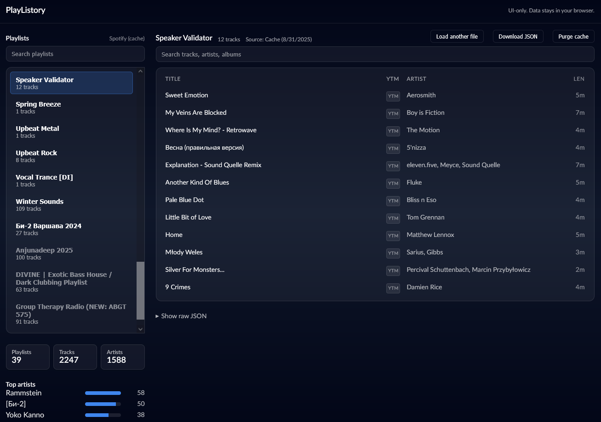
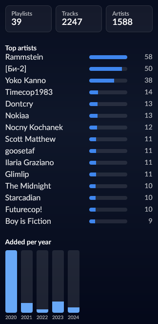

## PlayListory
[Live demo](https://a-lkt.github.io/PlayListory)

A tiny, open‑source, weekend project to help surface long‑forgotten Spotify likes and playlists. I needed a way to access an old, no‑longer‑premium Spotify account so I could rediscover my liked songs and then listen to them on YouTube Music (which I’m subscribed to now). This app lets you browse your Spotify library in the browser and quickly jump to YouTube Music searches for any track.

### What it is

- A single‑page React + Vite app that runs entirely in your browser.
- Two ways to load your library:
  - Connect to Spotify using Authorization Code with PKCE (no server).
  - Or upload a local Spotify JSON export you already have.
- Once loaded, you can filter/search playlists and tracks, view quick stats (top artists, when you added tracks), and open songs on Spotify or search them on YouTube Music.







### Basic principles

- Privacy by default: processing happens locally in your browser.
- No server component or account on my side.
- OAuth tokens live in `localStorage`; fetched playlist data may be cached in IndexedDB for faster reloads. You can clear it from the UI.
- Simple, purposeful UI: find, filter, and migrate your music taste with minimal friction.

### Why (personal motivation)

I had years of likes in an old Spotify account that I no longer pay for. I still wanted those songs in my listening rotation on YouTube Music. This app was built to quickly browse that history and jump straight to YouTube Music searches to re‑add the tracks there.

## Quick start (Windows)

Prerequisites: Node.js 18+ and npm.

1) Install dependencies and run the dev server

```powershell
cd web
npm install
npm run dev
```

2) Configure Spotify OAuth (optional, only needed if you want live fetching)

- Create a Spotify app in the [Spotify Developer Dashboard](https://developer.spotify.com/dashboard).
- Add a Redirect URI that matches your local dev URL (for example `http://127.0.0.1:5173/` or `http://localhost:5173/`) and any deployed URL you plan to use.
- Create a `.env` file in `web/` based on `web/env.example` and set:

```env
VITE_SPOTIFY_CLIENT_ID=your_client_id_here
VITE_SPOTIFY_REDIRECT_URI=http://127.0.0.1:5173/
```

If you don’t want to authenticate, you can instead load a local JSON export (see Usage below).

## Usage

- Option 1: Connect Spotify
  - Click “Connect Spotify”, approve the requested scopes, then click “Fetch my playlists”. Liked songs are pulled into a virtual playlist.
- Option 2: Upload JSON
  - Drop a Spotify export `.json` file to browse it locally (nothing is uploaded anywhere).
- Extras
  - Use the search boxes to filter playlists and tracks.
  - Click the external‑link icon next to a track title to open a YouTube Music search for that song and artist.
  - Use “Download JSON” to export the currently loaded data.
  - Use “Purge cache” to clear any local IndexedDB cache.

## How it works (privacy and data)

- All processing is in‑browser. There is no backend.
- Access tokens (when using Spotify login) are stored in `localStorage` and refreshed using PKCE.
- Optionally, fetched playlist/track data is cached in IndexedDB for quicker reloads; this can be purged at any time from the UI.

## Tech

- React + Vite (static site)
- PKCE OAuth against Spotify Accounts service
- Local storage + IndexedDB for tokens and cache

## Open source and attribution

This is open source. If you use or fork it, please attribute back to this repository (`spotify-viewr`) and/or the project name “PlayListory”. Contributions and suggestions are welcome.

Not affiliated with Spotify or YouTube. For personal/archival use only. Respect the terms of service of each platform.


